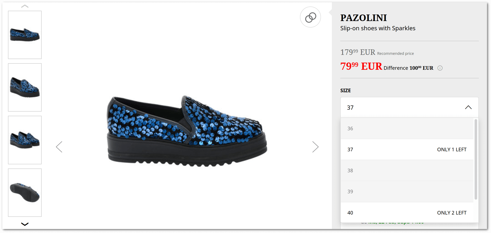

# Master Products

> The master products feature is scheduled to be released with [Vanilo 3.1](roadmap.md)

Master products is a module to constitute [Product Variants](product-variants.md) using
the [model based, hierarchical approach](product-variants.md#the_two_approaches).

This module is optional, and if you don't need its features, then stick with
the simple [Product models](products.md).

## Overview

The master products module ships with two additional eloquent models,
besides the simple, regular [Product](products.md) model:

- `MasterProduct`, and
- `MasterProductVariant`.

Unlike with the [Links Module](links.md), the Master Product module expresses
product variant relationships in the model layer, in a very explicit way.

Common attributes (name, description, pictures, etc) are defined in the
`MasterProduct` model, but the variant specifics (size, price, SKU, etc)
are stored with the `MasterProductVariant`.

The master product has no stock, but the individual variants have.

The _master product_ is **not** a `Buyable`, thus it can't be purchased, thrown into the
cart, added to an order, paid, etc. The _variant_ is the `Buyable`, and it always
has a master product linked with it, so these two types always co-exist.

As a consequence, a product of this kind is stored in two tables: `master_products` and `master_product_variants`.

## Usage In A Nutshell

To briefly illustrate the usage of such models, see an example of shoes offered in different sizes:

```php
$shoe = MasterProduct::create(['name' => 'Pazolini', 'price' => 79.99, 'excerpt' => 'Slip-on shoes with Sparkles']);
$shoe->assignProperties(['for' => 'women', 'brand' => 'Pazolini', 'shoe-type' => 'Loafers'])

$shoe->createVariant(['properties' => ['shoe-size' => 36], 'sku' => 'PZLBL-037', 'stock' => 0])
$shoe->createVariant(['properties' => ['shoe-size' => 37], 'sku' => 'PZLBL-037', 'stock' => 1])
$shoe->createVariant(['properties' => ['shoe-size' => 38], 'sku' => 'PZLBL-038', 'stock' => 0])
$shoe->createVariant(['properties' => ['shoe-size' => 39], 'sku' => 'PZLBL-039', 'stock' => 0])
$shoe->createVariant(['properties' => ['shoe-size' => 40], 'sku' => 'PZLBL-050', 'stock' => 2])
```

After having created this, you'll be able to display the product page of the master product,
and allow the shopper to select one of the sizes and throw one of the variants into the cart:


